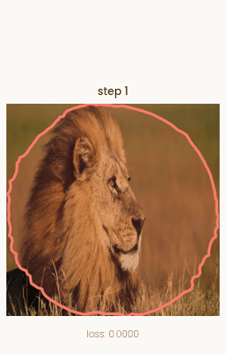
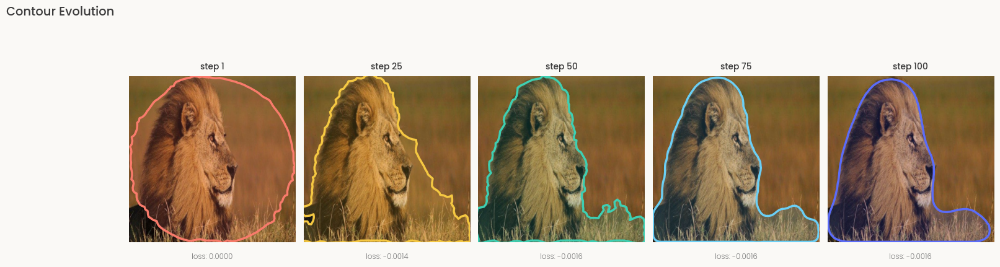
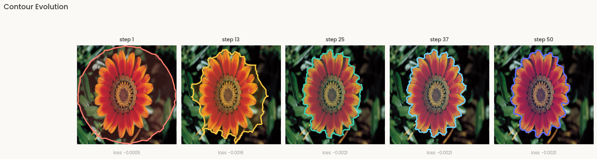
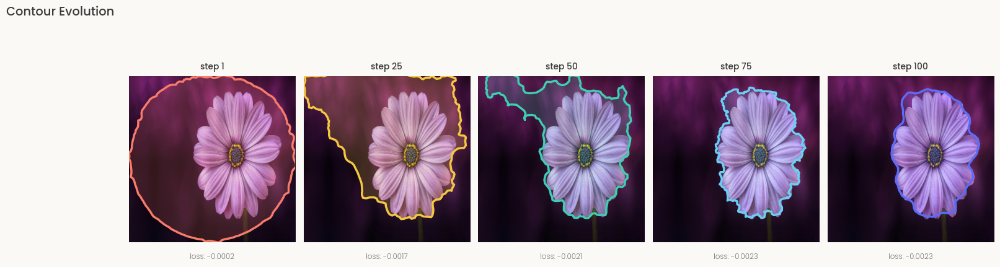
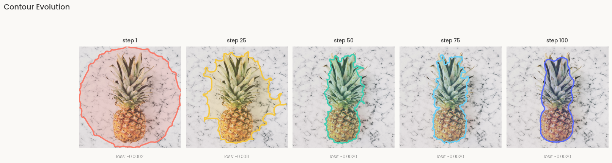
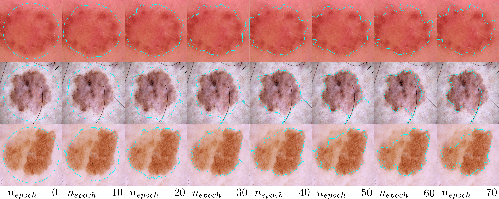

<div align="center">

# Deep ContourFlow

### Training-free active contours powered by deep features

[](https://www.python.org/)
[](https://pytorch.org/)
[](https://arxiv.org/abs/2407.10696)
[](./LICENSE)

[](https://github.com/antoinehabis/Deep-ContourFlow/actions/workflows/ci.yml)
[](https://huggingface.co/spaces/antoinehabis/DeepContourFlow)

[](https://pepy.tech/project/torch_contour)
[](https://pepy.tech/project/torch_contour)

</div>

> **Deep ContourFlow (DCF)** segments objects by *evolving a contour* — like a classical active contour / snake — but instead of hand-crafted image energies it is driven by the rich multi-scale features of a **frozen, pretrained CNN**. There is **no training and no annotated dataset required**: the contour itself is the only thing that is optimized.

<div align="center">



<sub><i>Unsupervised DCF — a single circle initialization flows toward the object boundary, guided only by deep features.</i></sub>

</div>

---

## ✨ Why DCF?

- 🧠 **Training-free** — uses a frozen ImageNet backbone (VGG16 / ResNet). No fine-tuning, no labels, no dataset to collect.
- 🎯 **Two regimes in one repo** — fully **unsupervised** segmentation, or **one-shot** segmentation from a *single* annotated example.
- 🔬 **Domain-agnostic** — works on natural images *and* medical imaging (histopathology, dermoscopy) out of the box.
- 🪶 **Lightweight & interpretable** — you optimize an explicit contour (a set of points), so every step is visualizable and the output is a clean, closed boundary.
- ⚡ **GPU / MPS ready** — built on PyTorch with optional mixed-precision.

---

## 🖼️ Results

### Unsupervised — real-life images

Starting from a simple circle, the contour is pushed to maximize the feature contrast between the inside and the outside of the curve.

<div align="center">






</div>

### One-shot — medical imaging

Given a **single** support image + mask, DCF transfers the target appearance to new query images and evolves a contour to match it.

<div align="center">


<sub><i>Dermoscopy — skin-lesion segmentation across optimization epochs.</i></sub>

<br><br>


<sub><i>Histopathology — tumor-region segmentation, with ground truth on the right.</i></sub>

</div>

---

## 🚀 Installation

```bash
git clone https://github.com/antoinehabis/Deep-ContourFlow.git
cd Deep-ContourFlow
pip install -e .
```

This installs the `deep_contourflow` package (and all dependencies) in editable mode, so you can `from deep_contourflow import UnsupervisedDCF, OneShotDCF` from anywhere. Prefer a bare dependency install? `pip install -r requirements.txt` also works.

DCF builds on the companion library [**`torch-contour`**](https://pypi.org/project/torch-contour/) (`Contour_to_mask`, `Contour_to_distance_map`, `CleanContours`, `Smoothing`, …), which is installed automatically.

---

## ⚡ Quick start

Two ready-to-run notebooks live in [`notebooks/`](./notebooks):

| Notebook | Mode | Open in Colab |
|----------|------|---------------|
| [`unsupervised_dcf.ipynb`](./notebooks/unsupervised_dcf.ipynb) | Unsupervised | [](https://colab.research.google.com/github/antoinehabis/Deep-ContourFlow/blob/master/notebooks/unsupervised_dcf.ipynb) |
| [`oneshot_dcf.ipynb`](./notebooks/oneshot_dcf.ipynb) | One-shot | [](https://colab.research.google.com/github/antoinehabis/Deep-ContourFlow/blob/master/notebooks/oneshot_dcf.ipynb) |

> In Colab, run a first cell to `!git clone` the repo and `%cd Deep-ContourFlow` so the `deep_contourflow` package is importable.

### Unsupervised segmentation

Drop your image in [`data/`](./data) and run:

```python
import cv2, numpy as np, torch, matplotlib.pyplot as plt
from torch_contour import CleanContours
from deep_contourflow import UnsupervisedDCF as DCF
from deep_contourflow.features import define_contour_init

device = torch.device("cuda" if torch.cuda.is_available() else "cpu")
height = 512

# 1. Load an image as a (1, 3, H, W) tensor in [0, 1]
img = cv2.resize(plt.imread("data/pineapple.jpg"), (height, height)).astype(np.uint8)
tensor = (torch.tensor(np.moveaxis(img, -1, 0)[None]) / 255).to(device)

# 2. Initialize a circular contour
contour_init, _ = define_contour_init(n=height, shape="circle", size=0.5)
contour_init = CleanContours().interpolate(contour_init, 200).clip(0, 1)
contour_init = torch.tensor(contour_init)[None, None].float().to(device)

# 3. Evolve the contour — no training, no labels
dcf = DCF(model="vgg16", n_epochs=100, learning_rate=1e-2, area_force=1e-3, sigma=5e-1)
contours, loss_history, final_contour = dcf.predict(tensor, contour_init)
```

### One-shot segmentation

Provide a **support image + mask** and a **query image**:

```python
from deep_contourflow import OneShotDCF as DCF

dcf = DCF(n_epochs=200, nb_augment=100, learning_rate=1e-2,
          augmentations=["rot90", "vflip"], lambda_area=1e-3)

# 1. Capture the target's features from a single annotated example
dcf.fit(tensor_support, contour_support)

# 2. Segment any new query image
contours, score, loss_history, energies = dcf.predict(tensor_query, contour_init)
```

See the notebook for the full data-loading and visualization code.

---

## 🔍 How it works

DCF revisits the classical **active contour (snake)** idea with modern deep features. A curve $\Gamma$ is represented by a set of points and deformed by gradient descent — but the energy that drives it comes from a **pretrained, frozen CNN** rather than raw image gradients.

1. **Feature extraction.** The input image is passed once through a frozen backbone (VGG16 by default; ResNet / ResNet-FPN also supported). Multi-scale activations are collected from several layers.
2. **Inside / outside pooling.** The current contour is rasterized into a soft mask (via `torch-contour`), which splits the feature maps into *inside* ($f_\text{in}$) and *outside* ($f_\text{out}$) regions.
3. **Contour energy.**
   - **Unsupervised:** maximize the contrast between inside and outside — minimize $-\lVert f_\text{in} - f_\text{out}\rVert\,/\,\lVert \text{activations}\rVert$ across scales.
   - **One-shot:** minimize the distance between the query's contour features and the *support* features aggregated at `fit()` time over many augmentations.
4. **Gradient flow.** The contour points are the **only** optimized variables. The displacement field is Gaussian-smoothed (`sigma`) and clipped (`clip`) for stable, regular evolution; an optional area term prevents collapse/explosion.
5. **Stopping.** A piecewise-linear fit on the loss curve (unsupervised) or early-stopping (one-shot) selects when to stop, and an optional GrabCut post-processing refines the final boundary.

Because the backbone is never updated, DCF needs **zero training** — it works on a single image, and adapts to new domains simply by swapping the backbone.

---

## 📁 Repository layout

```
deep_contourflow/        # The installable package
├── unsupervised.py      #   UnsupervisedDCF
├── oneshot.py           #   OneShotDCF (fit + predict)
├── features.py          #   Feature aggregation & contour utilities
├── postprocessing.py    #   Optional GrabCut refinement
├── visualization.py     #   Contour-evolution plotting helpers
└── models/              #   Frozen backbones (VGG16, ResNet, ResNet-FPN)
notebooks/                # Ready-to-run notebooks
data/                    # Sample images (+ ground-truth masks in data/gt)
assets/                  # Figures used in this README
```

---

## 📜 Citation

If you use this code, please cite:

```bibtex
@misc{habis2024deepcontourflowadvancingactive,
      title        = {Deep ContourFlow: Advancing Active Contours with Deep Learning},
      author       = {Antoine Habis and Vannary Meas-Yedid and Elsa Angelini and Jean-Christophe Olivo-Marin},
      year         = {2024},
      eprint       = {2407.10696},
      archivePrefix= {arXiv},
      primaryClass = {cs.CV},
      url          = {https://arxiv.org/abs/2407.10696},
}
```

---

## 🤝 Contributing

Issues and pull requests are welcome! If DCF helped your work, a ⭐ on the repo is the best way to support the project.

## 📬 Contact

Antoine Habis — [](mailto:antoine.habis.tlcm@gmail.com)

## 📄 License

Released under the [MIT License](./LICENSE).
