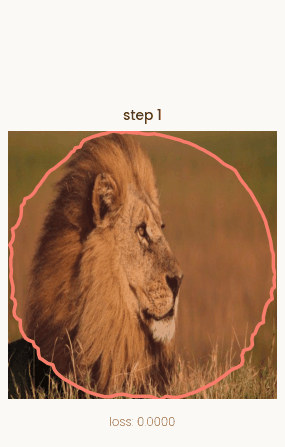
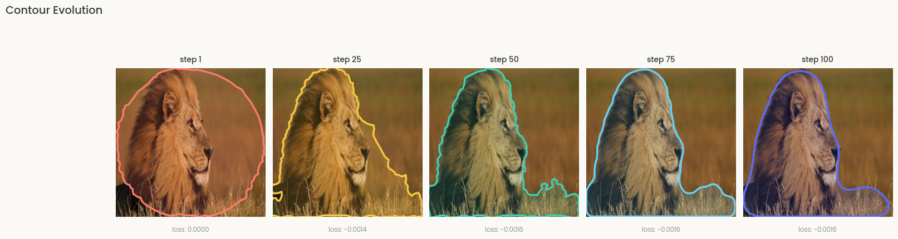
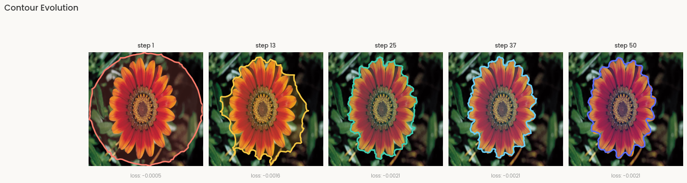
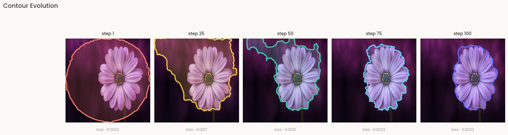
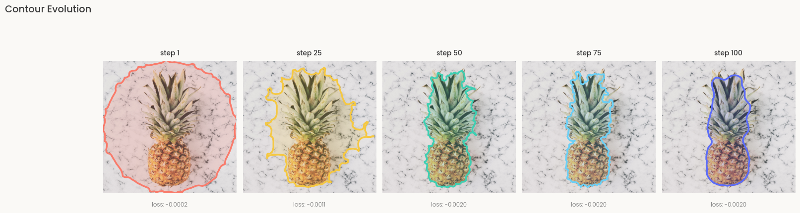
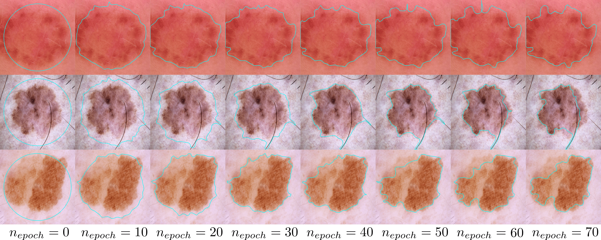

<div align="center">

# Deep ContourFlow

### Training-free active contours powered by deep features

[](https://www.python.org/)
[](https://pytorch.org/)
[](https://arxiv.org/abs/2407.10696)
[](./LICENSE)

[](https://github.com/antoinehabis/Deep-ContourFlow/actions/workflows/ci.yml)
[](https://huggingface.co/spaces/antoinehabis/DeepContourFlow)

[](https://pepy.tech/project/torch_contour)
[](https://pepy.tech/project/torch_contour)

</div>

> **Deep ContourFlow (DCF)** segments objects by *evolving a contour* — like a classical active contour / snake — but instead of hand-crafted image energies it is driven by the rich multi-scale features of a **frozen, pretrained CNN**. There is **no training and no annotated dataset required**: the contour itself is the only thing that is optimized.

<div align="center">



<sub><i>Unsupervised DCF — a single circle initialization flows toward the object boundary, guided only by deep features.</i></sub>

</div>

---

## ✨ Why DCF?

- 🧠 **Training-free** — uses a frozen ImageNet backbone (VGG16 / ResNet). No fine-tuning, no labels, no dataset to collect.
- 🎯 **Two regimes in one repo** — fully **unsupervised** segmentation, or **one-shot** segmentation from a *single* annotated example.
- 🔬 **Domain-agnostic** — works on natural images *and* medical imaging (histopathology, dermoscopy) out of the box.
- 🪶 **Lightweight & interpretable** — you optimize an explicit contour (a set of points), so every step is visualizable and the output is a clean, closed boundary.
- ⚡ **GPU / MPS ready** — built on PyTorch with optional mixed-precision.

---

## 🖼️ Results

### Unsupervised — real-life images

Starting from a simple circle, the contour is pushed to maximize the feature contrast between the inside and the outside of the curve.

<div align="center">






</div>

### One-shot — medical imaging

Given a **single** support image + mask, DCF transfers the target appearance to new query images and evolves a contour to match it.

<div align="center">


<sub><i>Dermoscopy — skin-lesion segmentation across optimization epochs.</i></sub>

<br><br>


<sub><i>Histopathology — tumor-region segmentation, with ground truth on the right.</i></sub>

</div>

---

## 🚀 Installation

```bash
git clone https://github.com/antoinehabis/Deep-ContourFlow.git
cd Deep-ContourFlow
pip install -e .
```

This installs the `deep_contourflow` package (and all dependencies) in editable mode, so you can `from deep_contourflow import UnsupervisedDCF, OneShotDCF` from anywhere. Prefer a bare dependency install? `pip install -r requirements.txt` also works.

To reproduce the published benchmark numbers instead, jump to
[**Benchmark**](#-benchmark--reproducing-the-results) — it is one `make reproduce`.

DCF builds on the companion library [**`torch-contour`**](https://pypi.org/project/torch-contour/) (`Contour_to_mask`, `Contour_to_distance_map`, `CleanContours`, `Smoothing`, …), which is installed automatically.

---

## ⚡ Quick start

Two ready-to-run notebooks live in [`notebooks/`](./notebooks):

| Notebook | Mode | Open in Colab |
|----------|------|---------------|
| [`unsupervised_dcf.ipynb`](./notebooks/unsupervised_dcf.ipynb) | Unsupervised | [](https://colab.research.google.com/github/antoinehabis/Deep-ContourFlow/blob/master/notebooks/unsupervised_dcf.ipynb) |
| [`oneshot_dcf.ipynb`](./notebooks/oneshot_dcf.ipynb) | One-shot | [](https://colab.research.google.com/github/antoinehabis/Deep-ContourFlow/blob/master/notebooks/oneshot_dcf.ipynb) |

> In Colab, run a first cell to `!git clone` the repo and `%cd Deep-ContourFlow` so the `deep_contourflow` package is importable.

### Unsupervised segmentation

Drop your image in [`data/`](./data) and run:

```python
import cv2, numpy as np, torch, matplotlib.pyplot as plt
from torch_contour import CleanContours
from deep_contourflow import UnsupervisedDCF as DCF
from deep_contourflow.features import define_contour_init

device = torch.device("cuda" if torch.cuda.is_available() else "cpu")
height = 512

# 1. Load an image as a (1, 3, H, W) tensor in [0, 1]
img = cv2.resize(plt.imread("data/pineapple.jpg"), (height, height)).astype(np.uint8)
tensor = (torch.tensor(np.moveaxis(img, -1, 0)[None]) / 255).to(device)

# 2. Initialize a circular contour at 35% of the image
contour_init, _ = define_contour_init(n=height, shape="circle", size=0.35)
contour_init = CleanContours().interpolate(contour_init, 200).clip(0, 1)
contour_init = torch.tensor(contour_init)[None, None].float().to(device)

# 3. Evolve the contour — no training, no labels
dcf = DCF(model="vgg16")
contours, loss_history, final_contour = dcf.predict(tensor, contour_init)
```

The defaults are the configuration validated on the benchmark below, so there is
nothing to tune to get those numbers. Every one of them can still be overridden —
`DCF(model="vgg16", n_epochs=100, sigma=0.5, area_force=0.0)` — and the full list
is in the `UnsupervisedDCF` docstring.

### One-shot segmentation

Provide a **support image + mask** and a **query image**:

```python
from deep_contourflow import OneShotDCF as DCF

dcf = DCF(n_epochs=200, nb_augment=100, learning_rate=1e-2,
          augmentations=["rot90", "vflip"], lambda_area=1e-3)

# 1. Capture the target's features from a single annotated example
dcf.fit(tensor_support, contour_support)

# 2. Segment any new query image
contours, score, loss_history, energies = dcf.predict(tensor_query, contour_init)
```

See the notebook for the full data-loading and visualization code.

---

## 📊 Benchmark — reproducing the results

DCF is evaluated as an **unsupervised foreground extractor** on three standard
object / saliency datasets. Nothing is trained and no mask is ever shown to the
algorithm — the ground truth is used *only* to score the contours it produces.

### One command

```bash
make reproduce
```

That downloads the three datasets (~1.3 GiB), converts them to a common layout,
and runs the benchmark. Every step also works on its own:

| Step | Command | What it does |
|------|---------|--------------|
| 0 | `make install` | `pip install -e ".[benchmark]"` — the package plus Hydra/Pillow |
| 1 | `make download` | Fetch + checksum + extract the datasets into `datasets/raw/` |
| 2 | `make format` | Convert them to `datasets/formatted/<dataset>/<id>/{image.jpg, mask.jpg}` |
| 3 | `make eval` | Run DCF over all 17 788 images and report IoU / Dice / pixel accuracy |

`make help` lists every target. Two shortcuts are useful while setting things up:

```bash
make smoke   # ~1 min — 4 ECSSD images, 15 steps: proves the pipeline runs
make quick   # ~7 min — the seeded 200-image subset reported below
```

### The datasets

Everything is fetched from the datasets' official hosts. Each archive is checked
against a known size **and** checksum before it is unpacked, downloads resume if
interrupted, and re-running skips whatever is already in place.

| Dataset | Images | Content | Download |
|---------|-------:|---------|----------|
| [**ECSSD**](https://www.cse.cuhk.edu.hk/leojia/projects/hsaliency/dataset.html) | 1 000 | Complex-scene saliency, one dominant object | 65 MiB |
| [**MSRA-B**](https://mmcheng.net/msra10k/) | 5 000 | Salient objects in natural images | 109 MiB |
| [**CUB-200-2011**](https://www.vision.caltech.edu/datasets/cub_200_2011/) | 11 788 | Birds of 200 species, figure-ground masks | 1.1 GiB |

Disk budget: ~1.3 GiB of archives, ~1.6 GiB extracted, ~1.3 GiB formatted. The
archives are only a cache — delete `datasets/archives/` (or pass
`--delete-archives`) once you are done.

If a host is unreachable, download the archives by hand from the links above,
drop them in `datasets/archives/` under their original filenames, and re-run
`make download`: the checksum check will pick them up instead of downloading.

### Results

Unsupervised DCF, no training and no labels, scored at 384×384. The numbers below
are from the **full benchmark** on all 17 788 images, validated with the knee
stopping condition (automatic early stopping at the energy curve's knee rather than
a fixed epoch):

```bash
make reproduce   # Full benchmark: ~3–4 h on one modern GPU
```

#### DCF Performance

| Dataset | Images | IoU | Dice | Pixel acc. | s / image |
|---------|-------:|------:|------:|-----------:|----------:|
| ECSSD | 1 000 | 0.678 | 0.776 | 0.898 | 0.75 |
| MSRA-B | 5 000 | 0.771 | 0.845 | 0.932 | 0.62 |
| CUB-200-2011 | 11 788 | 0.685 | 0.786 | 0.935 | 0.65 |
| **Macro average** | **17 788** | **0.711** | **0.802** | **0.922** | |

#### Comparison with other methods

**Understanding the training paradigms:**

| Paradigm | Pretraining Type | Fine-tuning on Target Task | Data on Target Dataset | Notes |
|---|---|---|---|---|
| **Strictly Training-Free** | None (hand-crafted) | None | None | RBD, GrabCut |
| **Supervised Backbone (Frozen)** | ImageNet supervised | None | None | DCF uses VGG16-ImageNet |
| **Self-Supervised Backbone (Frozen)** | SSL (DINO, etc) | None | None | TokenCut, LOST use DINO |
| **Multimodal Backbone (Frozen)** | Text-Image pretraining | None | None | FOCUS uses MLLM (Qwen-VL) |
| **Weakly Supervised** | ImageNet supervised | Yes (on image labels) | Image class labels only | CAM, ACoL |
| **Fully Supervised** | ImageNet supervised | Yes (on masks) | Full segmentation masks | PoolNet, EGNet, PoolNet, MINet |

**Key insight:** All methods requiring **zero target-dataset data** (first 4 rows) differ by their *pretraining source*, but none train/fine-tune on the target task. "Weakly Supervised" and "Fully Supervised" require collecting labeled data for the target dataset.

---

**Salient Object Detection (ECSSD & MSRA-B)** — grouped by pretraining paradigm:

#### **CNN Supervised Backbone (Frozen) — Zero Target Data**

| Method | ECSSD F | MSRA-B F | Backbone | Mechanism |
|--------|---:|---:|---|---|
| **🥇 Deep ContourFlow** | **0.829** | **0.865** | VGG16-ImageNet | Active contour evolution |

---

#### **Self-Supervised Backbone (Frozen) — Zero Target Data**

| Method | ECSSD F | MSRA-B F | Backbone | Mechanism |
|--------|---:|---:|---|---|
| TokenCut | 0.874 | — | DINO-SSL | Normalized Cut on attention |
| LOST | — | — | DINO-SSL | Attention seed selection |

*Note: Different pretraining (self-supervised DINO vs supervised ImageNet).*

---

#### **Multimodal Backbone (Frozen) — Zero Target Data**

| Method | ECSSD F | MSRA-B F | Backbone | Mechanism |
|--------|---:|---:|---|---|
| FOCUS | 0.915 | — | MLLM (Qwen-VL) | MLLM attention maps |

*Requires MLLM inference (server latency). DCF is 0.75s/image locally.*

---

#### **Traditional Algorithms (No Learning) — Zero Target Data**

| Method | ECSSD F | MSRA-B F | Backbone | Mechanism |
|--------|---:|---:|---|---|
| RBD | 0.782 | 0.825 | Hand-crafted | Boundary connectivity heuristics |
| GrabCut | 0.732 | 0.758 | Hand-crafted | Graph-cut on color priors |

**DCF vs Traditional:** +6.0% (ECSSD) / +4.9% (MSRA-B). Benefits from pretrained CNN backbone.

---

#### **Methods Requiring Target-Dataset Training**

| Method | Type | ECSSD F | MSRA-B F | Data Needed |
|--------|---|---:|---:|---|
| DeepUSPS | Unsupervised + Iterative | 0.887 | 0.912 | Pseudo-labels on target |
| EGNet | Fully Supervised | 0.947 | 0.963 | Full masks on target |
| PoolNet | Fully Supervised | 0.944 | 0.962 | Full masks on target |
| MINet | Fully Supervised | 0.953 | — | Full masks on target |

**DCF vs Training Methods:** -5.8% to -11.5% performance gap, but **zero target data required**. Transfers to new domains (medical imaging) without retraining.

**Figure-Ground Segmentation (CUB-200-2011)** — grouped by pretraining paradigm:

#### **CNN Supervised Backbone (Frozen) — Zero Target Data**

| Method | mIoU (%) | Backbone | Mechanism |
|--------|---:|---|---|
| **🥇 Deep ContourFlow** | **68.5** | VGG16-ImageNet | Active contour evolution |

---

#### **Self-Supervised Backbone (Frozen) — Zero Target Data**

| Method | mIoU (%) | Backbone | Mechanism |
|--------|---:|---|---|
| TokenCut | 58.8 | DINO-SSL | Normalized Cut on attention |
| LOST | 54.3 | DINO-SSL | Attention seed selection |

**DCF vs SSL methods:** +9.7% vs TokenCut. Both training-free; DCF uses simpler active-contour framework.

---

#### **Traditional Algorithms (No Learning) — Zero Target Data**

| Method | mIoU (%) | Backbone | Mechanism |
|--------|---:|---|---|
| GrabCut | 53.2 | Hand-crafted | Graph-cut on color priors |

**DCF vs Traditional:** +15.3% improvement.

---

#### **Methods Requiring Target-Dataset Training**

| Method | Type | mIoU (%) | Data Needed |
|--------|---|---:|---|
| ACoL | Weakly Supervised | 54.1 | Class labels only |
| CAM | Weakly Supervised | 43.6 | Class labels only |

**DCF vs Training Methods:** +14.4% to +24.9% gap, but **zero target data required**.

For development and debugging, a faster subset run is also available:

```bash
python -m experiments.foreground_extraction.eval data.max_samples=200
```

This evaluates a seeded 200-image subset of each dataset (~7 min) and produces
results very close to the full benchmark.

### How a score is produced

Each image is resized to a 384×384 square, a solid border frame is cropped if one
is detected, a circle is initialized at 35 % of the image and evolved for at most
250 steps, the evolution is stopped at the knee of its energy curve, GrabCut
refines the final contour, and the resulting polygon is rasterized and compared
to the ground truth. Per-dataset scores are averaged over images; the macro
average weights each **dataset** equally, so the 11 788-image CUB does not drown
out the 1 000-image ECSSD.

The full procedure, and every knob, is documented in
[`experiments/foreground_extraction/`](./experiments/foreground_extraction/).

### Notes on reproducibility

- **The config is pinned.** `experiments/foreground_extraction/conf/config.yaml`
  sets *every* DCF hyperparameter explicitly instead of inheriting library
  defaults, so changing a default in `deep_contourflow` cannot silently move
  these numbers. Override any of them from the command line:
  ```bash
  python -m experiments.foreground_extraction.eval dcf.sigma=0.5 'datasets=[ecssd]'
  ```
- **Subsets are seeded.** `data.max_samples=N` draws a fixed random subset
  (`data.seed`, default 1234) rather than the first N ids — which on CUB would be
  a single bird species.
- **Runs vary by ~±0.01 IoU.** DCF enables cuDNN autotuning and mixed precision,
  so GPU results are not bit-deterministic. Differences smaller than 0.01 IoU are
  noise, not signal.
- **Formatting is deterministic.** Re-running `make format` reproduces the image
  and mask files byte for byte, and skips samples that already exist.

---

## 🔍 How it works

DCF revisits the classical **active contour (snake)** idea with modern deep features. A curve $\Gamma$ is represented by a set of points and deformed by gradient descent — but the energy that drives it comes from a **pretrained, frozen CNN** rather than raw image gradients.

1. **Feature extraction.** The input image is passed once through a frozen backbone (VGG16 by default; ResNet / ResNet-FPN also supported). Multi-scale activations are collected from several layers.
2. **Inside / outside pooling.** The current contour is rasterized into a soft mask (via `torch-contour`), which splits the feature maps into *inside* ($f_\text{in}$) and *outside* ($f_\text{out}$) regions.
3. **Contour energy.**
   - **Unsupervised:** maximize the contrast between inside and outside — minimize $-\lVert f_\text{in} - f_\text{out}\rVert\,/\,\lVert \text{activations}\rVert$ across scales.
   - **One-shot:** minimize the distance between the query's contour features and the *support* features aggregated at `fit()` time over many augmentations.
4. **Gradient flow.** The contour points are the **only** optimized variables. The displacement field is Gaussian-smoothed (`sigma`) and clipped (`clip`) for stable, regular evolution; an optional area term prevents collapse/explosion.
5. **Stopping.** Both modes stop the same way: the loss curve is a staircase — descents separated by plateaus where the contour settles — so the contour is taken at the **knee**, the onset of the last plateau (`deep_contourflow.knee`), rather than at the last epoch or the global minimum, which keep creeping past the object onto sub-parts. An optional GrabCut post-processing then refines the boundary.

Because the backbone is never updated, DCF needs **zero training** — it works on a single image, and adapts to new domains simply by swapping the backbone.

---

## 📁 Repository layout

```
deep_contourflow/         # The installable package
├── unsupervised.py       #   UnsupervisedDCF
├── oneshot.py            #   OneShotDCF (fit + predict)
├── features.py           #   Feature aggregation & contour utilities
├── knee.py               #   Where to stop the evolution (knee of the energy curve)
├── postprocessing.py     #   Optional GrabCut refinement
├── visualization.py      #   Contour-evolution plotting helpers
└── models/               #   Frozen backbones (VGG16, ResNet, ResNet-FPN)

scripts/
├── download_datasets.py  # Fetch + checksum + extract the benchmark datasets
└── format_datasets.py    # Convert them all to one <id>/{image.jpg, mask.jpg} layout

experiments/foreground_extraction/
├── conf/config.yaml      # Every benchmark hyperparameter, pinned
├── dataset.py            # Dataset, dataloader, frame crop/remap, contour init
├── metrics.py            # IoU / Dice / pixel accuracy
├── eval.py               # Benchmark entry point (Hydra)
└── results/              # One timestamped folder per run + latest.json

datasets/                 # Created by `make datasets` — git-ignored
├── archives/             #   Downloaded .zip / .tgz (cache; safe to delete)
├── raw/                  #   Extracted datasets, as published
└── formatted/            #   <dataset>/<image_id>/{image.jpg, mask.jpg}

notebooks/                # Ready-to-run notebooks
data/                     # Sample images (+ ground-truth masks in data/gt)
assets/                   # Figures used in this README
Makefile                  # make help / datasets / eval / reproduce
```

---

## 📜 Citation

If you use this code, please cite:

```bibtex
@misc{habis2024deepcontourflowadvancingactive,
      title        = {Deep ContourFlow: Advancing Active Contours with Deep Learning},
      author       = {Antoine Habis and Vannary Meas-Yedid and Elsa Angelini and Jean-Christophe Olivo-Marin},
      year         = {2024},
      eprint       = {2407.10696},
      archivePrefix= {arXiv},
      primaryClass = {cs.CV},
      url          = {https://arxiv.org/abs/2407.10696},
}
```

If you run the benchmark, please also cite the datasets it uses — CUB-200-2011
(Wah *et al.*, 2011), ECSSD (Yan *et al.*, CVPR 2013) and MSRA-B (Liu *et al.*,
"Learning to Detect A Salient Object", CVPR 2007). Each is redistributed by its
original authors under its own terms; `scripts/download_datasets.py` only fetches
them from those official hosts.

---

## 🤝 Contributing

Issues and pull requests are welcome! If DCF helped your work, a ⭐ on the repo is the best way to support the project.

## 📬 Contact

Antoine Habis — [](mailto:antoine.habis.tlcm@gmail.com)

## 📄 License

Released under the [MIT License](./LICENSE).
